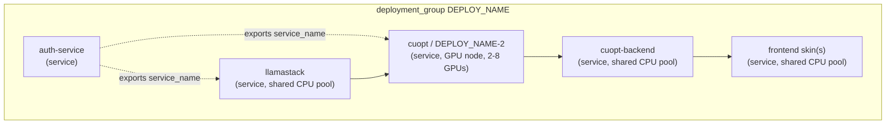
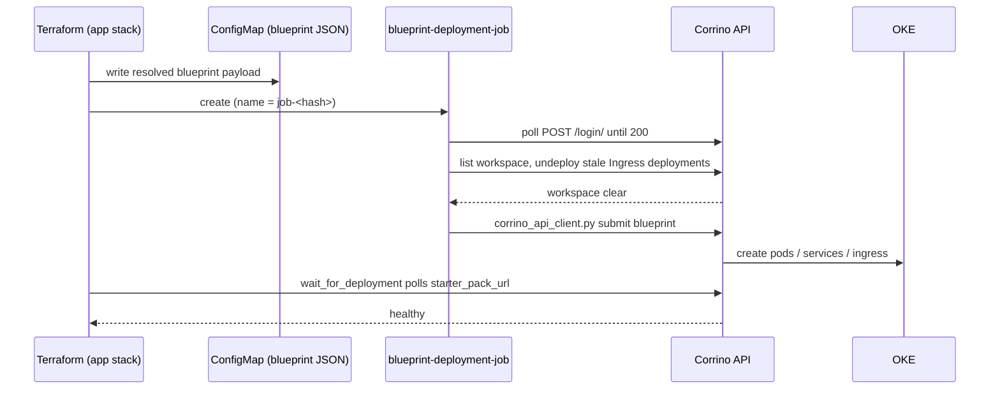

# Blueprints & Recipes — Design Reference

> **Audience:** Engineers adding or modifying a starter pack's application layer.
> Companion to [`DESIGN.md`](./DESIGN.md) (§5) and [`BLUEPRINT_LIFECYCLE.md`](./BLUEPRINT_LIFECYCLE.md).

This document is the reference for how starter-pack **application workloads** are described and
deployed via **OCI AI Blueprints** (the **Corrino** control plane). `DESIGN.md` covers the platform
end-to-end; this file goes deep on the blueprint payload: recipes, `recipe_mode`, deployment groups,
and how the payload reaches Corrino. For the *idempotency mechanics* of immutable redeploys (content
hashing, `random_id`, Job replacement, the `DEPLOY_NAME` placeholder), read
[`BLUEPRINT_LIFECYCLE.md`](./BLUEPRINT_LIFECYCLE.md).

---

## 1. What a blueprint is

A **blueprint** is a JSON document submitted to the Corrino API. Corrino translates it into the
Kubernetes objects (deployments, services, ingress, secrets, PVCs) that make up a running pack.
Blueprints must conform to the Corrino combined schema
(`~/code/corrino/api/json_schema/combined_schema.json`, JSON Schema Draft 2020-12).

Two foundational rules govern everything:

1. **Deployments are immutable.** There is no in-place update; the only way to change a running
   deployment is to undeploy it and redeploy. This is why the Terraform side (the deployment Job)
   does *undeploy-then-deploy*, and why the lifecycle is hash-driven.
2. **`deployment_name` must be unique** within the Corrino workspace. Re-submitting an existing name
   is a validation error — hence the random-suffixed names produced at resolve time.

Every pack **except `enterprise_rag`** deploys through blueprints. `enterprise_rag` uses Helm
directly (`helm.tf`) because of its NIM-Operator topology; its `blueprint_files.tf` entries are empty
strings.

---

## 2. Where blueprints live in the code

```
vars.tf                        local.starter_pack_configs   (infra view: shapes, GPU counts, pools)
blueprint_files.tf             local.starter_pack_blueprints (app view: the JSON payloads)
app-blueprint-deployment-job.tf  the K8s Job that submits the payload to Corrino
```

`local.starter_pack_blueprints` is a `category → size → payload` map. Each payload is a `jsonencode`
of one **deployment group** (or an empty string for Helm packs):

```hcl
# blueprint_files.tf
starter_pack_blueprints = {
  "cuopt" = { "poc" = local._cuopt_blueprint, "small" = local._cuopt_blueprint, "medium" = local._cuopt_blueprint }
  "vss"   = { "poc" = local._vss_poc_blueprint, "small" = local._vss_small_blueprint, "medium" = local._vss_medium_blueprint }
  "paas_rag" = { "small" = local._paas_rag_small_blueprint, "medium" = local._paas_rag_small_blueprint }
  "dox_pack" = { "small" = local._dox_pack_small_blueprint }
  "warehouse_pick_path" = { "small" = local._warehouse_pick_path_small_blueprint }
  "enterprise_rag"     = { "small" = "" }            # Helm-deployed; no blueprint
  "enterprise_rag_aiq" = { "small" = "", "medium" = "" }
}
```

The active payload is selected as
`local.starter_pack_blueprints[var.starter_pack_category][var.starter_pack_size]`.

---

## 3. Anatomy of a blueprint payload

A payload is a single **deployment group** containing an ordered list of **deployments**. Each
deployment wraps a **recipe** (the actual workload spec) plus its `name`, `exports`, and
`depends_on`.

```json
{
  "deployment_group": {
    "name": "DEPLOY_NAME",
    "deployments": [
      { "name": "...", "exports": ["service_name"], "depends_on": [...], "recipe": { ... } },
      ...
    ]
  }
}
```

### 3.1 Real example — the cuOpt blueprint

From `blueprint_files.tf` (`local._cuopt_blueprint`), the group composes a LlamaStack service, the
cuOpt GPU service, a backend, frontend skin(s), and (optionally) an auth service via `concat(...)`:

```hcl
_cuopt_blueprint = jsonencode({
  deployment_group = {
    name = "DEPLOY_NAME"
    deployments = concat(
      [
        {
          name       = "llamastack"
          exports    = ["service_name"]
          depends_on = var.enable_auth_service ? ["auth-service"] : []
          recipe = {
            recipe_id                    = "llamastack"
            deployment_name              = "llamastack"
            recipe_mode                  = "service"
            recipe_image_uri             = "iad.ocir.io/.../llama-stack-oci:v0.0.3"
            recipe_replica_count         = 1
            recipe_flex_shape_ocpu_count = 1
            recipe_flex_shape_memory_size_in_gbs = 8
            recipe_node_shape            = local.starter_pack_config.cpu_worker_node_pool_instance_shape.instanceShape
            recipe_use_shared_node_pool  = true
            recipe_container_port        = "8321"
            recipe_container_command_args = ["/config/config.yaml"]
            recipe_container_env = [
              { key = "OCI_COMPARTMENT_OCID", value = var.compartment_ocid },
              { key = "OCI_REGION",           value = var.genai_region },
              { key = "OCI_AUTH_TYPE",        value = "instance_principal" },
            ]
            recipe_secret_mounts = [
              { name = "llamastack-inference-config", mount_location = "/config" }
            ]
          }
        },
        {
          name       = "cuopt"
          exports    = ["service_name"]
          depends_on = var.enable_auth_service ? ["auth-service"] : []
          recipe = {
            recipe_id                    = "cuopt"
            deployment_name              = "DEPLOY_NAME-2"      # second deployment → unique suffix
            recipe_mode                  = "service"
            recipe_image_uri             = "nvcr.io/nvidia/cuopt/cuopt:25.10.0-cuda12.9-py3.13"
            recipe_container_secret_name = local.ngc_secrets.docker_secret_name
            recipe_node_shape            = local.starter_pack_config.worker_node_shape   # GPU shape
            recipe_nvidia_gpu_count      = var.starter_pack_size == "poc" ? 2 : 8
            recipe_use_shared_node_pool  = true
            recipe_ephemeral_storage_size = 200
            recipe_shared_memory_volume_size_limit_in_mb = 16384
            recipe_environment_secrets = [ { envvar_name = "NVIDIA_API_KEY", secret_name = "nvidia-api-secret", secret_key = "NVIDIA_API_KEY" } ]
            recipe_container_command_args = ["python","-m","cuopt_server.cuopt_service","-p","5000","-g", var.starter_pack_size == "poc" ? "2" : "8"]
            recipe_liveness_probe_params  = { port = 5000, endpoint_path = "/v2/health/live",  initial_delay_seconds = 1200, ... }
            recipe_readiness_probe_params = { port = 5000, endpoint_path = "/v2/health/ready", initial_delay_seconds = 20,  ... }
          }
        },
      ],
      local.cuopt_backend_recipe,          # backend deployment(s)
      local._cuopt_frontend_deployments,   # one per enabled frontend skin
      local.auth_service_recipe            # auth-service when enable_auth_service
    )
  }
})
```

Note how infra and app stay linked: `recipe_node_shape` and `recipe_nvidia_gpu_count` are read from
`local.starter_pack_config` (the size-specific block in `vars.tf`), so the workload lands on the node
pool Terraform actually created.

---

## 4. Recipe fields

A recipe is the workload spec. The fields actually used across this repo's blueprints, grouped by
concern:

| Concern | Fields |
|---|---|
| **Identity** | `recipe_id`, `deployment_name`, `recipe_mode` |
| **Container** | `recipe_image_uri`, `recipe_container_port`, `recipe_host_port`, `recipe_container_command`, `recipe_container_command_args`, `recipe_container_secret_name` |
| **Compute (CPU/flex)** | `recipe_node_shape`, `recipe_flex_shape_ocpu_count`, `recipe_flex_shape_memory_size_in_gbs`, `recipe_replica_count` |
| **GPU / storage** | `recipe_nvidia_gpu_count`, `recipe_ephemeral_storage_size`, `recipe_shared_memory_volume_size_limit_in_mb`, `recipe_storage_group_id` |
| **Node placement** | `recipe_use_shared_node_pool`, `recipe_node_pool_size` |
| **Config & secrets** | `recipe_container_env`, `recipe_environment_secrets`, `recipe_secret_mounts`, `recipe_configmaps` |
| **Health probes** | `recipe_liveness_probe_params`, `recipe_readiness_probe_params`, `recipe_startup_probe_params` |
| **Ingress** | `recipe_additional_ingress_annotations`, `recipe_additional_ingress_ports` |

Two distinct secret mechanisms: `recipe_environment_secrets` injects a Kubernetes Secret value as an
env var (e.g. the NVIDIA API key), while `recipe_secret_mounts` mounts a secret as files at a path
(e.g. LlamaStack's config). `recipe_container_secret_name` is the image-pull secret.

---

## 5. `recipe_mode`

The Corrino schema enum is `["service", "job", "update", "shared_node_pool", "team"]`:

| Mode | Meaning |
|---|---|
| `service` | Long-running workload exposed by a Kubernetes Service (and optionally ingress). |
| `job` | Run-to-completion batch workload. |
| `update` | In-place update of an existing deployment (where Corrino permits). |
| `shared_node_pool` | Declares a pool of nodes that other recipes schedule onto. |
| `team` | Multi-tenant quotas / priority at the cluster level. |

**In this repository, every deployed recipe uses `recipe_mode = "service"`.** Co-location is achieved
through `recipe_use_shared_node_pool = true` rather than an explicit `shared_node_pool` recipe (see
§6). If you add a batch step (e.g. a one-shot ingestion/migration), `job` is the mode to reach for.

---

## 6. Deployment groups

A **deployment group** bundles several deployments that make up one pack, deploys them as a unit, and
gives them a shared lifecycle and dependency graph. Three mechanisms make this work:

### 6.1 Ordering — `depends_on`

Each deployment lists the names it must wait for. In the cuOpt example, services depend on
`auth-service` when auth is enabled so Corrino collects its exports before resolving references.

### 6.2 Cross-references — `exports` + `$${name.field}`

A deployment declares what it `exports` (commonly `service_name`). Other deployments reference it via
Corrino's placeholder syntax `$${auth-service.service_name}` (the doubled `$$` escapes Terraform's
own interpolation so the literal `${...}` reaches Corrino). This is how, e.g., a backend ingress
annotation points at the auth service's resolved name.

### 6.3 Co-location — `recipe_use_shared_node_pool`

Setting `recipe_use_shared_node_pool = true` schedules CPU-bound services (LlamaStack, frontends,
backends) onto a shared CPU pool (`VM.Standard.E5.Flex`) instead of provisioning a dedicated pool per
service. GPU recipes set `recipe_node_shape` to the GPU shape and `recipe_nvidia_gpu_count` so they
land on the dedicated GPU pool. This keeps non-GPU services off expensive GPU nodes.

### 6.4 Unique names within a group — the `DEPLOY_NAME` placeholder

The group's `name` is the literal `"DEPLOY_NAME"`; additional deployments needing a distinct name use
`"DEPLOY_NAME-2"`, `"DEPLOY_NAME-3"`, etc. At resolve time these become a stable canonical name (for
hashing) or a random-suffixed unique name (for the actual API submission). The full mechanism is in
[`BLUEPRINT_LIFECYCLE.md`](./BLUEPRINT_LIFECYCLE.md).



---

## 7. How the payload reaches Corrino

`app-blueprint-deployment-job.tf` creates a Kubernetes Job whose name carries the blueprint content
hash (`blueprint-deployment-job-<hex>`). The blueprint JSON is mounted from a ConfigMap. The Job runs
an inline script that:

1. **Waits for the Corrino API** — polls `POST /login/` until it returns `200` (≈ up to 5 min).
2. **Undeploys stale deployments** — logs in for a token, lists the workspace, finds Ingress-type
   deployments, undeploys each, and polls until the workspace is clear (up to ~10 min). This is what
   guarantees the immutable redeploy doesn't collide on `deployment_name`.
3. **Submits the new blueprint** — runs `corrino_api_client.py` against the mounted JSON.

The completed Job is kept for a long TTL (`ttl_seconds_after_finished`) so Terraform doesn't see
drift and re-run it on a no-op apply. After deploy, `null_resource.wait_for_deployment` polls the
starter-pack URL until healthy before the URL output resolves.



---

## 8. Adding or changing a pack's blueprint — checklist

1. Add/extend the `starter_pack_configs[category][size]` block in `vars.tf` (node shapes, GPU count,
   pool sizes, boot volumes, DB sizing). This drives the OKE node pools.
2. Define the payload local in `blueprint_files.tf` (`local._<category>_<size>_blueprint`) and wire
   it into `local.starter_pack_blueprints`. Read compute/GPU fields from `local.starter_pack_config`
   so the workload matches the provisioned pools.
3. Use `"DEPLOY_NAME"` for the group, `"DEPLOY_NAME-N"` for extra named deployments — never a literal
   unique name.
4. Put CPU-bound services on `recipe_use_shared_node_pool = true`; reserve GPU nodes for GPU recipes.
5. Validate the JSON against the Corrino combined schema before testing.
6. Add the `tests/starter_pack_<category>.tftest.hcl` plan test (asserts deployment name + postflight
   triggers) and run the unit-test suite.
7. Follow the rest of the new-category checklist in [`DESIGN.md`](./DESIGN.md) §5.2 (schema, schema
   expectations, `CATEGORIES`).

---

## 9. Related reading

- [`BLUEPRINT_LIFECYCLE.md`](./BLUEPRINT_LIFECYCLE.md) — immutable-redeploy idempotency
  (content hashing, `random_id`, Job replacement, `DEPLOY_NAME` resolution, DNS subdomain rationale).
- [`DESIGN.md`](./DESIGN.md) — full platform architecture, two-stack model, schema system.
- `~/code/corrino/api/json_schema/combined_schema.json` — authoritative recipe/blueprint schema.
