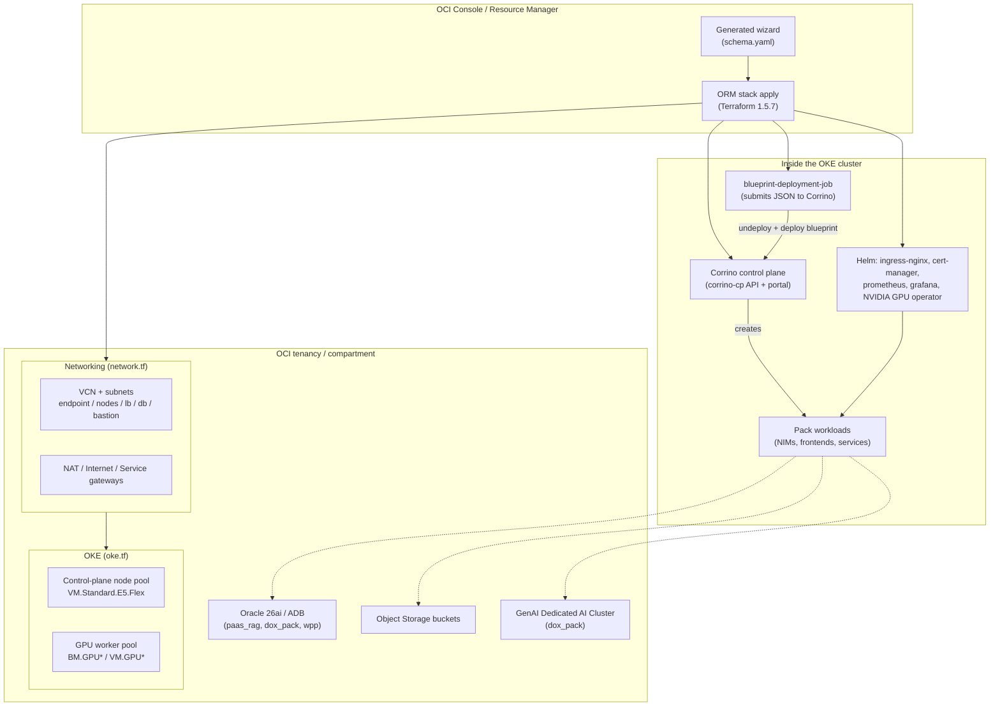
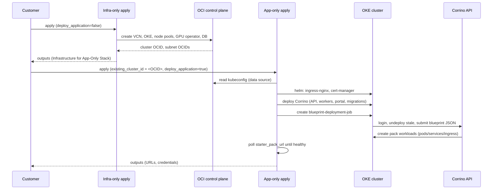
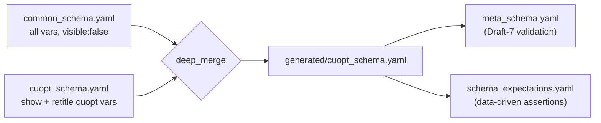

# AI Accelerator Starter Packs — Engineering Design Document

> **Status:** Living document · **Audience:** Engineers and stakeholders onboarding to the project · **Last updated:** 2026-06-01

This document explains *how the AI Accelerator Starter Packs system is built and why*. It is an
onboarding/reference architecture record, not a per-feature proposal. It covers the platform as a
whole, then drills into the three pillars an engineer most needs to understand to be productive:

1. The **two-stack deployment model** (`deploy_application` / `deploy_infrastructure`).
2. The **ORM schema generation system** (how the OCI Console wizard is produced).
3. **New-pack integration via OCI AI Blueprints** — deployment groups and recipe files.

Companion documents:

- [`BLUEPRINTS.md`](./BLUEPRINTS.md) — deep dive on blueprints, recipes, `recipe_mode`, and deployment groups.
- [`BLUEPRINT_LIFECYCLE.md`](./BLUEPRINT_LIFECYCLE.md) — how Terraform manages immutable blueprint redeploys idempotently (content hashing, `random_id`, Job replacement).
- [`about.md`](./about.md) — product-facing description and per-pack hardware sizing tables.
- [`../NAMING.md`](../NAMING.md) — canonical mapping of category keys ↔ console names ↔ display names.
- [`VERSIONING.md`](./VERSIONING.md), [`TESTING.md`](./TESTING.md), [`iam-policies.md`](./iam-policies.md).

---

## 1. Overview

AI Accelerator Starter Packs is a Terraform-based infrastructure-as-code project that deploys
production-ready Gen AI / accelerated-compute workloads on **Oracle Cloud Infrastructure (OCI)**
using **Oracle Kubernetes Engine (OKE)**. A single Terraform module — published as an **OCI Resource
Manager (ORM)** stack — provisions networking, an OKE cluster, GPU/CPU node pools, supporting Helm
charts, and the **Corrino** control plane (OCI AI Blueprints), then deploys one of several
self-contained application "starter packs."

A *starter pack* is a category of workload. As of this writing:

| Category key | Short name | GPU | Deploy mechanism |
|---|---|---|---|
| `cuopt` | Vehicle Route Optimizer | Yes | Blueprint |
| `vss` | Video Search & Summarization | Yes | Blueprint |
| `enterprise_rag` | Self-Hosted Enterprise Chat Agent | Yes | **Helm** (not blueprint) |
| `enterprise_rag_aiq` | Agentic AI Starter Kit | Yes | Blueprint |
| `paas_rag` | Managed Enterprise Chat Agent | No | Blueprint |
| `warehouse_pick_path` | Warehouse Pick Path Optimizer | Yes | Blueprint |
| `dox_pack` | Document Extractor | No (GPU in managed DAC) | Blueprint |

See [`../NAMING.md`](../NAMING.md) for full display names and console zip names. The category is
selected at build time via `starter_pack_category.auto.tfvars` and drives nearly all conditional
logic in the module.

### 1.1 Design goals & constraints

| Goal / constraint | Consequence in the design |
|---|---|
| **One module, many packs.** A single TF codebase serves every pack. | Heavy use of `local`-driven `category → size → config` maps and `count`/`for_each` gating instead of separate modules. |
| **Runs inside OCI Resource Manager.** Customers deploy from the OCI Console, not a CLI. | The UI is generated from a `schema.yaml`; ORM caps Terraform at **1.5.7**, so all code must be 1.5-compatible. |
| **Self-service, low-touch.** A customer picks a pack + size and clicks apply. | Capacity pre-checks, sensible defaults, and a generated wizard that hides irrelevant variables. |
| **Workloads are managed by Corrino (OCI AI Blueprints).** | Application layout is expressed as JSON *blueprints*; deployments are **immutable** (undeploy + redeploy only). |
| **Infrastructure should outlive the app.** Switching/redeploying a pack shouldn't rebuild the cluster. | Infra and app are separately gated layers (`deploy_infrastructure` / `deploy_application`). The default apply builds both; the gates *optionally* let you deploy infra-only or app-only (the "two-stack" workflow). |

### 1.2 Terraform version split

ORM supports up to **Terraform 1.5.7**, so production code must stay 1.5-compatible
(`required_version = ">= 1.5"` in `versions.tf`). However, the unit-test harness uses
`mock_provider`, which requires **Terraform ≥ 1.7**. The language constructs under test (locals,
`count`, `for_each`, validations) behave identically across 1.5–1.9, so this split is safe — but
**CI must run the test job on ≥ 1.7**, never 1.5.

---

## 2. System architecture

### 2.1 Repository layout

```
ai-accelerator/
├── ai-accelerator-tf/          # ALL Terraform code lives here (zip root for ORM)
│   ├── vars.tf                 # Inputs + validations + local.starter_pack_configs
│   ├── app-locals.tf           # Core locals: local.app, gating flags, image URIs
│   ├── network.tf  oke.tf      # VCN/subnets/gateways; OKE cluster + node pools
│   ├── helm.tf                 # ingress-nginx, cert-manager, prometheus, grafana, GPU operator
│   ├── blueprint_files.tf      # local.starter_pack_blueprints — JSON payloads (~125 KB)
│   ├── app-blueprint-deployment-job.tf  # K8s Job that submits blueprints to Corrino
│   ├── app-*.tf                # Corrino API, background workers, user, configmap, migration, portal
│   ├── capacity_check.tf       # Pre-deploy GPU/shape capacity validation
│   ├── outputs.tf              # Outputs surfaced in the ORM UI
│   ├── schema.yaml             # GENERATED ORM wizard (gitignored)
│   ├── schemas/                # Schema source + generator inputs + tests
│   └── tests/                  # Terraform unit tests (*.tftest.hcl)
├── create_final_schema.py      # Schema deep-merge generator
├── docs/                       # This document and companions
└── BUGS.md                     # Institutional bug knowledge base
```

### 2.2 Providers

`versions.tf` declares nine providers; the OCI provider is pinned to `~> 7.0`. `providers.tf`
configures multiple OCI aliases plus the Kubernetes and Helm providers:

- **`oci`** (default) — current region. Supports instance-principal auth (`use_instance_principal`)
  or user/API-key auth.
- **`oci.home_region`** — IAM resources (dynamic groups, policies) live in the tenancy home region.
- **`oci.genai_region`** — for packs that call OCI GenAI in a specific region (`paas_rag`, `dox_pack`).
- **`kubernetes` / `helm`** — configured from the OKE cluster endpoint via an `exec` block that calls
  `oci ce cluster generate-token`. The host/CA come from `local.provider_host` /
  `local.cluster_ca_certificate`, derived from the cluster kubeconfig data source so the same code
  works whether the cluster was just created or already exists.

> **Known sharp edge:** when destroying, the Kubernetes/Helm providers can fail to refresh. Use
> `terraform destroy --refresh=false` (documented in `CLAUDE.md`).

### 2.3 Component diagram



### 2.4 Control plane: Corrino / OCI AI Blueprints

Every pack except `enterprise_rag` deploys its workloads as **OCI AI Blueprints** submitted to the
**Corrino** control plane (`corrino-cp`), a Django API + portal that runs *on* the OKE cluster.
Terraform stands up Corrino (API service, background workers, Postgres, migrations, a superuser),
then a Kubernetes Job posts a JSON blueprint to the Corrino API, which in turn creates the pack's
pods/services/ingress. `enterprise_rag` is the exception — it is deployed directly via Helm
(`helm.tf`) because of its NIM-Operator-based topology.

Full detail in [`BLUEPRINTS.md`](./BLUEPRINTS.md) and [`BLUEPRINT_LIFECYCLE.md`](./BLUEPRINT_LIFECYCLE.md).

---

## 3. Pillar 1 — Infra/app layering (the optional two-stack model)

> **TL;DR:** The **default and most common path is a single apply that deploys both the
> infrastructure and the application together** — one ORM stack, everything stands up at once. The
> "two-stack model" is an *opt-in* mode, controlled by explicit booleans, for the cases where you
> want infra-only or app-only. You never *have* to deploy them separately.

### 3.1 The three deployment modes

The same codebase supports three modes, selected by two inputs:

| Mode | How to select it | What it does |
|---|---|---|
| **Both (default)** | Leave the defaults: `deploy_application = true`, no `existing_cluster_id` | Single apply provisions infra **and** the application — the normal customer path. |
| **Infra only** | `deploy_application = false` | Stands up VCN/OKE/node pools/GPU operator/DB and stops. No Corrino, no workloads. |
| **App only** | Set `existing_cluster_id` to a pre-existing cluster OCID | Skips infra creation; deploys the application onto the existing cluster. |

So the "two stacks" are really two *layers* of one module that the default path applies in a single
shot. You only split them into separate applies when you deliberately want to — for example, to
**switch or redeploy a pack without rebuilding the cluster** (infra-only once, then app-only
repeatedly). Blueprint deployments are immutable and GPU bring-up is slow and capacity-constrained,
so being *able* to preserve the infra layer across app redeploys is valuable — but it is an option,
not a requirement.

- **Infra layer** — VCN, OKE cluster, node pools, GPU operator, databases. Long-lived; reusable.
- **App layer** — Helm app releases, Corrino, blueprint Job, Kubernetes workloads, app buckets.
  Cheap to destroy and redeploy.

### 3.2 The gating flags

Two booleans, resolved once in `app-locals.tf`, drive everything. **Both default to deploying the
respective layer**, so an out-of-the-box apply builds both:

```hcl
# app-locals.tf
deploy_application    = var.deploy_application          # default true (vars.tf)
use_existing_cluster  = var.existing_cluster_id != ""   # default "" → false
deploy_infrastructure = !local.use_existing_cluster     # default true
effective_cluster_id  = local.use_existing_cluster ? var.existing_cluster_id : local.oke_cluster.id
```

- **`deploy_application`** (`vars.tf`, default `true`) — when left at `true` the app layer is built;
  set it to `false` to skip all application-layer resources: *"Use this to create an
  infrastructure-only stack."*
- **`deploy_infrastructure`** is derived and defaults to `true` (no `existing_cluster_id`). Supplying
  an existing cluster OCID flips the module into "app-only against pre-existing infra" mode.
- **Default state:** both are `true`, so the common single apply creates the cluster *and* deploys
  the application. The two flags are independent knobs; the two-stack workflow is just the case where
  you exercise them one layer at a time across two separate stacks.

Compound flags fan these out per category so the conditions aren't repeated across files:

```hcl
deploy_app_vss      = local.deploy_application && var.starter_pack_category == "vss"
deploy_app_rag      = local.deploy_application && contains(["enterprise_rag","enterprise_rag_aiq"], var.starter_pack_category)
deploy_app_non_rag  = local.deploy_application && !contains(["enterprise_rag","enterprise_rag_aiq"], var.starter_pack_category)
run_capacity_checks = local.deploy_infrastructure && !var.skip_capacity_check
```

Resources then guard with `count = local.deploy_application ? 1 : 0` (or `deploy_infrastructure`),
which is why nearly every resource in the module is indexed `[0]` and read back through `try(...)`.

### 3.3 Responsibility split

| Layer | Owned by | Gate | Examples |
|---|---|---|---|
| VCN / subnets / gateways | Infra | `create_network_resources = deploy_infrastructure && network_configuration_mode == "create_new"` | `network.tf` |
| OKE cluster + node pools | Infra | `deploy_infrastructure` | `oke.tf` |
| **NVIDIA GPU operator** | **Infra** | `deploy_infrastructure && uses_gpu` | `helm.tf` — *intentionally* infra-owned so its lifecycle is decoupled from per-pack app redeploys |
| Database (26ai / ADB) | Infra | `needs_26ai && deploy_infrastructure` | `26ai.tf` |
| ingress-nginx, cert-manager | App | `deploy_application` | `helm.tf` |
| Corrino (API, workers, portal, migrations, user) | App | `deploy_application` | `app-*.tf` |
| Blueprint deployment Job | App | `deploy_application` | `app-blueprint-deployment-job.tf` |
| App-specific Helm releases (rag, etc.) | App | `deploy_application` + category flag | `helm.tf` |
| Object Storage buckets | App | `deploy_application && needs_object_storage` | `object_storage.tf` |

> **Ownership rule of thumb:** infrastructure-layer resources (network, cluster, node-level device
> drivers, databases) belong to the infra stack; application-layer resources (workloads, services,
> ingress *rules*) belong to the app stack. The GPU operator is deliberately infra-owned because it
> manages node-level GPU device state that must survive app redeploys.

### 3.4 How the app stack finds pre-existing infra

When `existing_cluster_id` is set, the app stack does **not** create a cluster. It reads cluster
state through a data source and extracts the kubeconfig:

- `data.oci_containerengine_cluster_kube_config.oke` is keyed on `local.effective_cluster_id`.
- `kubernetes.tf` decodes the kubeconfig YAML into `provider_host`, `cluster_ca_certificate`, and
  `cluster_id`, which the Kubernetes/Helm providers consume.
- Subnet/VCN references fall back to `var.existing_*_subnet_id` when network resources weren't
  created locally (e.g. `network.oke_node_subnet_id` in `app-locals.tf`).

The infra stack publishes the cluster OCID, subnet OCIDs, and node-pool OCIDs as **outputs** (the
"Infrastructure (for App-Only Stack)" output group), which a customer pastes into the app stack's
inputs. This is the hand-off contract between the two stacks.

### 3.5 Network modes

`network_configuration_mode ∈ {create_new, bring_your_own}` (validated in `vars.tf`):

- **`create_new`** — the module builds the VCN/subnets/gateways.
- **`bring_your_own`** — the customer supplies `existing_vcn_id` and `existing_*_subnet_id`; the
  module skips network creation and references those OCIDs.

The cluster resource itself is split into two definitions (`oke_cluster` for `create_new`,
`oke_cluster_existing_vcn` for `bring_your_own`), reconciled into a single `local.oke_cluster`.

### 3.6 Deployment sequence

**Default (single apply, both layers):** with defaults left in place, one `terraform apply` runs the
infra steps then the app steps in the same run against the cluster it just created — the customer
does not split anything.

**Optional two-stack workflow (shown below):** when you deliberately split, you run an infra-only
apply first, hand its outputs to a second app-only apply. This is the sequence that exercises the
hand-off contract from §3.4:



### 3.7 Known failure modes (teardown ordering)

The split introduces ownership seams where destroy ordering matters. These are tracked in
[`../BUGS.md`](../BUGS.md):

- **BUG-013** — Infra destroy isn't enforced to run *after* app destroy. If the app stack is still
  up, infra destroy fails deleting subnets still referenced by app-created resources.
- **BUG-014** — `ingress-nginx` lives in the app stack but provisions an **OCI load balancer**.
  `helm uninstall` returns before the OCI cloud-controller finishes deleting the LB, so a racing
  infra destroy fails on the LB subnet. Proposed fix: move ingress-nginx to the infra stack and add
  a `wait_for_lb_cleanup` destroy provisioner.
- **BUG-018** — On `BM.GPU4.8`, destroying/redeploying the app stack can leave a GPU node reporting
  `nvidia.com/gpu = 0`. Root cause is GPU-operator lifecycle churn — another argument for keeping
  the operator infra-owned and adding a device-plugin restart on operator teardown.

**Operational contract:** always destroy the app stack before the infra stack.

---

## 4. Pillar 2 — ORM schema generation system

### 4.1 Problem

The OCI Console renders the deployment wizard from a single `schema.yaml`. Hand-maintaining one
schema per pack would drift from `vars.tf` and from each other. Instead, schemas are **generated**
by deep-merging a shared base with per-category overrides.

### 4.2 Inputs and pipeline

```
schemas/common_schema.yaml          (base: every variable, defaults to visible:false)
schemas/<category>_schema.yaml       (per-pack overrides: title, sizes, which vars to show)
        │
        ▼
create_final_schema.py  <category>   (deep-merge)
        │
        ▼
schemas/generated/<category>_schema.yaml   (and schema.yaml for the active category)
```

```bash
python create_final_schema.py -c cuopt     # one category
python create_final_schema.py --all      # all categories (used by tests)
```

`CATEGORIES` in `create_final_schema.py` is the authoritative list:
`["cuopt", "vss", "paas_rag", "enterprise_rag", "enterprise_rag_aiq", "warehouse_pick_path", "dox_pack"]`.

The generated `schema.yaml` and `schemas/generated/` are **gitignored** — always regenerate, never
hand-edit.

### 4.3 The merge algorithm

`deep_merge(base, override)` in `create_final_schema.py`:

- **Dicts** merge recursively.
- **Lists** are *replaced wholesale* — **except** `variableGroups` and `outputGroups`, which are
  merged by their `title` key (`merge_list_by_key`): matching titles let the override replace the
  base entry, base order is preserved, new entries are appended.
- **Scalars** (including `visible`) are replaced.

The critical consequence: **`visible` is just a scalar key.** If `common_schema.yaml` sets
`visible: false` and the per-category schema omits it, the merged result stays `visible: false`.
**Group-level visibility does not override a variable's own `visible`.** To *show* a variable in a
pack, that pack's schema must explicitly set `visible: true` (or a boolean condition) on the
variable itself.

### 4.4 common_schema.yaml structure

- **Metadata** — title, description, `schemaVersion`, version.
- **Output groups** — Service, Frontend, Management & API, Monitoring, Bastion, Version,
  *Infrastructure (for App-Only Stack)*. The last group is the two-stack hand-off contract (§3.4).
- **Variable groups** — Basic Hidden, Deployment Configuration, OCI Blueprints Admin Account,
  Authentication, Advanced Options (capacity check, bastion, DNS, infra/app gates, existing-cluster
  fields).
- **Variables** — every `vars.tf` variable, declared with `visible: false` as the safe default.

The invariant *"every `vars.tf` variable has an entry in `common_schema.yaml`"* is what prevents
ORM from rendering an unschematized variable as a raw, customer-editable field.



### 4.5 The recurring visibility bug class

A large share of schema bugs in [`../BUGS.md`](../BUGS.md) share one root cause: **variable-level
visibility is authoritative; group-level visibility cannot un-hide a variable.**

- **BUG-001 / 025 / 026** — a pack-specific variable existed in `vars.tf` but not in
  `common_schema.yaml`, so it leaked into *other* packs' wizards as a visible field using its
  `vars.tf` default. Fix: add a hidden (`visible: false`) fallback in `common_schema.yaml`.
- **BUG-027** — cuOpt frontend credentials were `visible: false` in common, the cuOpt schema
  re-declared them with rich metadata but omitted `visible: true`, expecting a *group-level*
  condition to render them. It didn't. Fix: set `visible: true` (or repeat the condition) on the
  variable itself.
- **BUG-034** — `worker_node_availability_domain` is `visible: false` in common; the
  `warehouse_pick_path` schema lacked the override block, so the wizard hid the field with no
  default and the `capacity_check.tf` precondition fast-failed on an empty value.

**Guardrails:** the `/schema-lint` skill and `TestTerraformVariablesControlledBySchema` enforce that
every `vars.tf` variable is schematized. Run `/schema-lint` whenever adding variables or editing
schemas.

### 4.6 Schema test architecture

In `ai-accelerator-tf/schemas/tests/`:

- `conftest.py` regenerates **all** schemas (`--all`) before the suite runs.
- `schema_expectations.yaml` holds the assertions (sizes per pack, required outputs/variables,
  pack-exclusive variables that must stay hidden elsewhere). **Add assertions there, not in Python.**
- `test_schema_structure.py` runs parametrized checks: valid YAML, conformance to `meta_schema.yaml`
  (OCI JSON Schema Draft 7), required keys, size enums match config, group references resolve, every
  `vars.tf` variable is schematized, frontend-skin catalog sync, and docs coverage.

---

## 5. Pillar 3 — New-pack integration via blueprints

This section summarizes the integration surface; [`BLUEPRINTS.md`](./BLUEPRINTS.md) is the full
reference for recipe fields, `recipe_mode`, and deployment groups.

### 5.1 Two layers: infra config vs. application blueprint

A pack is described in two complementary places:

1. **`local.starter_pack_configs`** (`vars.tf`) — the **infrastructure** view: a
   `category → size → config` map giving node shapes, GPU counts, pool sizes, boot volumes, and DB
   sizing. This shapes the OKE node pools Terraform creates. Example (`cuopt` / `poc`):

   ```hcl
   "cuopt" = { "poc" = {
     blueprint_file               = "cuopt-with-marketing-blueprint.json"
     deployment_name              = "cuopt"
     worker_node_shape            = "VM.GPU.A10.2"   # GPU pool
     worker_node_pool_size        = 1
     cpu_worker_node_pool_size    = 1                # shared CPU pool
     control_plane_node_pool_size = 2
     node_pool_boot_volume_size_in_gbs = "150"
     control_plane_node_pool_instance_shape = { instanceShape = "VM.Standard.E5.Flex", ocpus = 3, memory = 64 }
     # ...database sizing, feature toggles (nvaie_enabled, create_ngc_secrets_in_cluster)
   }}
   ```

2. **`local.starter_pack_blueprints`** (`blueprint_files.tf`) — the **application** view: the JSON
   payload (built with `jsonencode(merge(...))`) submitted to Corrino. It consumes the config from
   step 1 and adds recipe IDs, container images/commands, env/secrets, node labels, storage, and
   ingress. It is structured as a **deployment group** containing one or more sub-deployments
   (microservices) with `depends_on` ordering and `$${export}` cross-references.

### 5.2 Adding a category — the checklist

Per `CLAUDE.md` and the Terraform rules, a new category touches:

1. `vars.tf` — add the validation enum value and a `starter_pack_configs[category][size]` block.
2. `app-locals.tf` — any category-specific mappings / gating flags.
3. `blueprint_files.tf` — the blueprint payload(s) for each size (unless Helm-deployed like
   `enterprise_rag`).
4. `schemas/<category>_schema.yaml` — a new override schema (title, sizes, which vars to show).
5. `create_final_schema.py` — add the key to `CATEGORIES`.
6. `schemas/tests/schema_expectations.yaml` — sizes, required vars/outputs, pack-exclusive hides.
7. `tests/starter_pack_<category>.tftest.hcl` — a plan test asserting deployment name + postflight.

### 5.3 Versioning

The stack version lives in `ai-accelerator-tf/AI_ACCELERATOR_STACK_VERSION` (currently `v0.0.8`) and
must stay in sync with the `vars.tf` default and the `schemas/common_schema.yaml` enum. See
[`VERSIONING.md`](./VERSIONING.md). Container image versions are tracked in
[`../SOFTWARE_VERSIONS.md`](../SOFTWARE_VERSIONS.md) and kept current with the `/sync-versions` skill.

---

## 6. Capacity, networking, and auth (supporting subsystems)

- **Capacity pre-check** (`capacity_check.tf`, `capacity_info.tf`) — before provisioning, the module
  validates GPU/shape availability so applies fail fast with a clear message rather than mid-way.
  Gated by `run_capacity_checks = deploy_infrastructure && !skip_capacity_check`.
  `worker_node_availability_domain` is required for all GPU packs (a missing value fast-fails the
  precondition — see BUG-034).
- **Networking** (`network.tf`) — `create_new` vs `bring_your_own`; public/private cluster
  endpoints; optional ORM private endpoint (`orm-private-endpoint.tf`) for private-network
  deployments (see [`private-network-deployment.md`](./private-network-deployment.md)).
- **DNS** — `nip.io` by default, or a custom domain (`use_custom_dns`); the stable
  `public_endpoint.starter_pack` subdomain uses the *static* (un-suffixed) deployment name to avoid a
  dependency cycle (see [`BLUEPRINT_LIFECYCLE.md`](./BLUEPRINT_LIFECYCLE.md)).
- **Auth** — optional auth service / OIDC (IDCS) integration (`auth-locals.tf`); see
  [`oci-idcs.md`](./oci-idcs.md) and [`features/auth-roles.md`](./features/auth-roles.md).
- **IAM** — minimum-privilege policies only; see [`iam-policies.md`](./iam-policies.md) and the OCI
  rules in `.claude/rules/oci.md`.

---

## 7. Testing & CI

| Layer | What it checks | Where |
|---|---|---|
| **Terraform unit tests** | Plan-only, fully mocked providers (no cloud). Per-pack deployment name + postflight triggers; variable validations via `expect_failures`. | `ai-accelerator-tf/tests/*.tftest.hcl` (TF ≥ 1.7) |
| **Schema tests** | Generated schemas valid, meta-schema-conformant, sizes/outputs/vars correct, no leaked variables. | `schemas/tests/` (pytest, Python 3.11+) |
| **Lint / security** | `terraform fmt`, `validate`, `tflint`, `checkov`. | `.checkov.yml`, `/lint` skill |
| **Integration** | Real ORM deploy → plan → apply → pod verification → destroy. | `/integration-test`, `/testing-pack`, `/deploy-and-test` skills |

CI workflows (`.github/workflows/`): `terraform-test.yml` (init + test on push/PR to `main`),
`terraform-lint.yml` (fmt/validate/tflint/checkov on PRs), `schema-tests.yml` (pytest when schemas
change). The full pre-commit suite is documented in `.claude/rules/ci-checks.md`. See
[`TESTING.md`](./TESTING.md) for the testing model in depth.

> **Bug knowledge base:** [`../BUGS.md`](../BUGS.md) is an ongoing record of what broke, why, and how
> it was fixed. Check it before investigating a new issue; log/fix entries with the `/bug-tracker`
> skill.

---

## 8. Key invariants (cheat sheet)

1. All Terraform lives in `ai-accelerator-tf/`; ORM zips have TF files at the **zip root**.
2. Code must be **Terraform 1.5.7-compatible**; tests run on **≥ 1.7**.
3. **Blueprint deployments are immutable** — undeploy + redeploy only; `deployment_name` must be
   unique per submission.
4. Never hand-edit `schema.yaml` or `schemas/generated/` — regenerate with `create_final_schema.py`.
5. Every `vars.tf` variable must appear in `common_schema.yaml`; **variable-level `visible` beats
   group-level**.
6. Destroy the **app stack before the infra stack**.
7. Keep `AI_ACCELERATOR_STACK_VERSION`, the `vars.tf` default, and the common-schema enum in sync.
8. Use **minimum-privilege IAM policies** — never `manage all-resources`.
```
