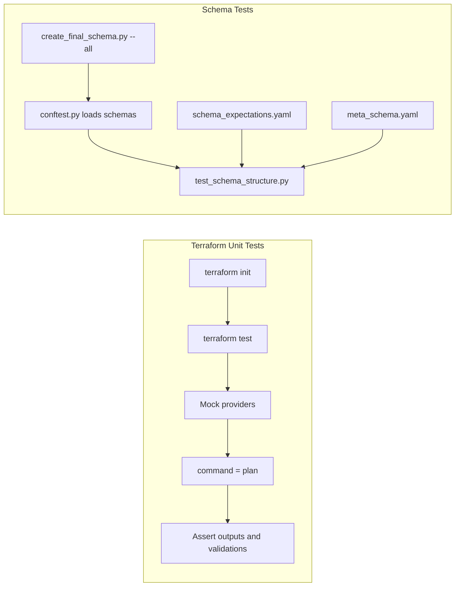
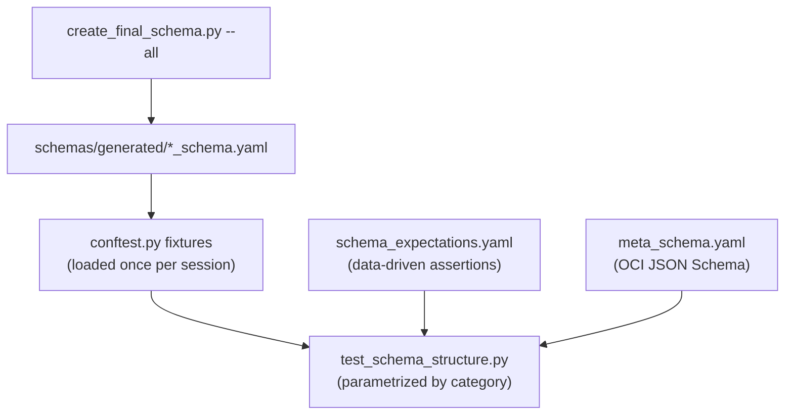

# Testing Guide

This project has two independent test suites that validate different aspects of the AI Accelerator Starter Packs:

| Suite                    | What it validates                                                                | Tool             | Location                           |
| ------------------------ | -------------------------------------------------------------------------------- | ---------------- | ---------------------------------- |
| **Terraform unit tests** | Variable validations, deterministic outputs, plan success per starter pack       | `terraform test` | `ai-accelerator-tf/tests/`         |
| **Schema tests**         | OCI Resource Manager schema structure, meta-schema conformance, cross-references | `pytest`         | `ai-accelerator-tf/schemas/tests/` |

Both suites run automatically in CI on push/PR to `main` and can be run locally with no cloud credentials.



---

## Quick Start

### Terraform Unit Tests

Requires **Terraform >= 1.7** locally (the module targets >= 1.5 for OCI Resource Manager, but `mock_provider` is a 1.7+ feature).

```bash
cd ai-accelerator-tf/

terraform init -backend=false
terraform test                                            # all tests
terraform test -filter=tests/core_plan.tftest.hcl         # single file
```

No cloud credentials or OCI config are needed -- all providers are mocked.

### Schema Tests

Requires **Python 3.11+**.

```bash
# From repository root
python3 -m venv venv
source venv/bin/activate
pip install -r requirements.txt

pytest ai-accelerator-tf/schemas/tests/ -v                # all tests
pytest ai-accelerator-tf/schemas/tests/ -v -s             # verbose output
```

---

## Terraform Unit Tests

### What They Test

These are **plan-only unit tests** that use mock providers. No infrastructure is created and no cloud credentials are required. They validate:

- **Variable validations** -- invalid inputs are rejected (e.g. bad network mode, weak passwords)
- **Deterministic outputs** -- outputs derived from variables and locals have correct values
- **Plan success** -- each starter pack category plans successfully with mock providers

### How They Work

Every test file uses `command = plan` combined with `mock_provider` blocks for all 9 providers (OCI, Kubernetes, Helm, TLS, local, null, cloudinit, random, http). Three OCI data sources that are indexed with `[0]` in the config require `override_data` blocks to supply realistic shapes.

### Test Files

All files live flat in `ai-accelerator-tf/tests/` (Terraform does not recurse into subdirectories).

| File                                     | What it covers                                                                                                                                  |
| ---------------------------------------- | ----------------------------------------------------------------------------------------------------------------------------------------------- |
| `core_plan.tftest.hcl`                   | Default plan with `enterprise_rag`, asserts shared outputs (VCN CIDR, endpoint visibility, admin credentials, db username)                      |
| `core_validations.tftest.hcl`            | 11 `expect_failures` runs testing variable validation blocks (network mode, visibility settings, starter pack category/size, db password rules) |
| `starter_pack_cuopt.tftest.hcl`          | cuOpt small plan -- deployment name, postflight triggers                                                                                        |
| `starter_pack_enterprise_rag.tftest.hcl` | Enterprise RAG small plan -- deployment name, postflight triggers                                                                               |
| `starter_pack_paas_rag.tftest.hcl`       | PaaS RAG small plan -- deployment name, postflight triggers, db username                                                                        |
| `starter_pack_vss.tftest.hcl`            | VSS small plan -- deployment name, postflight triggers                                                                                          |

For details on what can and cannot be tested at plan time, how to add or modify tests, and boilerplate to copy -- see **[ai-accelerator-tf/tests/RULES.md](../ai-accelerator-tf/tests/RULES.md)**.

---

## Schema Tests

### What They Test

Schema tests validate the OCI Resource Manager YAML schemas generated for each starter pack category (cuopt, vss, paas_rag, enterprise_rag). They check:

- **Structure** -- required top-level keys exist (`title`, `variables`, `outputGroups`, etc.)
- **Meta-schema conformance** -- each schema validates against the OCI meta schema (JSON Schema Draft 7)
- **Cross-references** -- outputs in `outputGroups` and variables in `variableGroups` reference real entries
- **Category-specific rules** -- required/absent outputs and variables, property values like `visible` and `type`

### How They Work



Tests are **data-driven**: most assertions are defined in `schema_expectations.yaml`, not in Python code. The pytest fixture in `conftest.py` runs `create_final_schema.py --all` once per session to generate all schemas before tests execute.

For details on test file roles, how to add assertions, and how to add a new category -- see **[ai-accelerator-tf/schemas/tests/RULES.md](../ai-accelerator-tf/schemas/tests/RULES.md)**.

---

## CI Pipelines

| Workflow            | File                                   | Trigger                                                                                                       | What it runs                                                                                                                                                                                                    |
| ------------------- | -------------------------------------- | ------------------------------------------------------------------------------------------------------------- | --------------------------------------------------------------------------------------------------------------------------------------------------------------------------------------------------------------- |
| **Terraform Tests** | `.github/workflows/terraform-test.yml` | Push/PR to `main` (all files)                                                                                 | `terraform init -backend=false` then `terraform test` with Terraform 1.9, dummy OCI config                                                                                                                      |
| **Terraform Lint**  | `.github/workflows/terraform-lint.yml` | PR to any branch                                                                                              | `terraform fmt -check`, `terraform validate`, TFLint (advisory), Checkov security scan (uses `ai-accelerator-tf/.checkov.yml` to skip selected checks; see [security_errors_fix.md](../security_errors_fix.md)) |
| **Schema Tests**    | `.github/workflows/schema-tests.yml`   | Push/PR to `main` when `ai-accelerator-tf/schemas/**`, `create_final_schema.py`, or the workflow file changes | `pip install -r requirements.txt` then `pytest ai-accelerator-tf/schemas/tests/ -v` with Python 3.11                                                                                                            |

The Terraform CI workflow creates a dummy OCI config (keypair + `~/.oci/config`) so that `terraform init` succeeds without real credentials.

### Terraform Lint / Checkov

The Terraform Lint workflow runs Checkov (version 3.2.501) against the Terraform in `ai-accelerator-tf`. Skips are configured in `ai-accelerator-tf/.checkov.yml` so specific checks can be excluded with documented reasons.

To run Checkov locally:

```bash
cd ai-accelerator-tf
pip install checkov==3.2.501
checkov -d . --framework terraform
```

To add or adjust skipped checks, edit `.checkov.yml` and add check IDs to the `skip-check` list with a short comment. For the full checklist of known issues and maintenance steps, see **[security_errors_fix.md](../security_errors_fix.md)**.

---

## Further Reading

- **[ai-accelerator-tf/tests/RULES.md](../ai-accelerator-tf/tests/RULES.md)** -- Detailed conventions, boilerplate, and step-by-step instructions for Terraform unit tests
- **[ai-accelerator-tf/schemas/tests/RULES.md](../ai-accelerator-tf/schemas/tests/RULES.md)** -- Detailed conventions and step-by-step instructions for schema tests
- **[Terraform Testing Documentation](https://developer.hashicorp.com/terraform/language/tests)** -- Official HashiCorp reference for `terraform test`, mock providers, run blocks, and assertions
