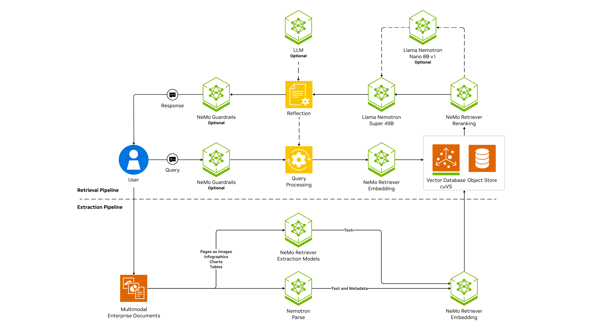

# Enterprise RAG Starter Pack

The Enterprise RAG Starter Pack packages GPU-backed infrastructure and the NVIDIA RAG Blueprint to run retrieval-augmented generation (RAG) workloads on Oracle Cloud Infrastructure (OCI). It provides a repeatable, production-oriented starting point for enterprise chat and knowledge-driven assistants.

**Quick Start**
- **Requirements:** OCI account, Kubernetes/OKE or VM hosts, and GPUs (recommended: 2× A100; consult the RAG Support Matrix for alternatives).
- **Access:** After deployment use the RAG web UI exposed by the stack.

**What this pack provides**
- **Hardware guidance:** Recommended GPU configurations and a tested model profile for enterprise workloads.
- **Software stack:** Configuration and orchestration to deploy NVIDIA RAG components (ingestors, retriever, RAG server, model profiles, and observability).

**Architecture**


**Deployment Architecture on OCI**

```
┌─────────────────────────────────────────────────────────────────────┐
│  OCI Tenancy                                                        │
│                                                                     │
│  ┌───────────────────────────────────────────────────────────────┐  │
│  │  VCN                                                          │  │
│  │                                                               │  │
│  │  ┌─────────────────────────────────────────────────────────┐  │  │
│  │  │  OKE Cluster                                            │  │  │
│  │  │                                                         │  │  │
│  │  │  ┌─────────────────────────────────────────────────┐    │  │  │
│  │  │  │  GPU Node Pool (2× A100 recommended)            │    │  │  │
│  │  │  │                                                 │    │  │  │
│  │  │  │  ┌──────────────┐  ┌──────────────────────┐     │    │  │  │
│  │  │  │  │  NIM LLM     │  │  NIM Embedding Model │     │    │  │  │
│  │  │  │  │  (Inference) │  │  (e5-large-v2)       │     │    │  │  │
│  │  │  │  └──────┬───────┘  └──────────┬───────────┘     │    │  │  │
│  │  │  │         │                     │                 │    │  │  │
│  │  │  │  ┌──────▼─────────────────────▼──────────┐      │    │  │  │
│  │  │  │  │          RAG Server                   │      │    │  │  │
│  │  │  │  │  (retrieval + generation pipeline)    │      │    │  │  │
│  │  │  │  └──────────────────┬────────────────────┘      │    │  │  │
│  │  │  │                     │                           │    │  │  │
│  │  │  │  ┌──────────────────▼───────────────────┐       │    │  │  │
│  │  │  │  │   Oracle DB 26ai (Vector Store)      │       │    │  │  │
│  │  │  │  └──────────────────────────────────────┘       │    │  │  │
│  │  │  │                                                 │    │  │  │
│  │  │  │  ┌──────────────────────────────────────┐       │    │  │  │
│  │  │  │  │  Ingestor (document processing)      │       │    │  │  │
│  │  │  │  └──────────────────────────────────────┘       │    │  │  │
│  │  │  └─────────────────────────────────────────────────┘    │  │  │
│  │  │                                                         │  │  │
│  │  │  ┌──────────────┐   ┌──────────────┐                    │  │  │
│  │  │  │  Ingress /   │   │  Blueprints  │                    │  │  │
│  │  │  │ Load Balancer│   │  Portal      │                    │  │  │
│  │  │  └──────┬───────┘   └──────────────┘                    │  │  │
│  │  └─────────┼───────────────────────────────────────────────┘  │  │
│  │            │                                                  │  │
│  └────────────┼──────────────────────────────────────────────────┘  │
│               │                                                     │
└───────────────┼─────────────────────────────────────────────────────┘
                │
                ▼
           RAG Web UI
      (chat + document upload)
```

**Useful links**
- **NVIDIA RAG docs (full):** https://docs.nvidia.com/rag/latest/
- **Upstream repo docs:** https://github.com/NVIDIA-AI-Blueprints/rag/tree/main/docs (deploy, support matrix, troubleshooting, developer guide)

**Notes**
The UI the model context window for small is set to 8192.