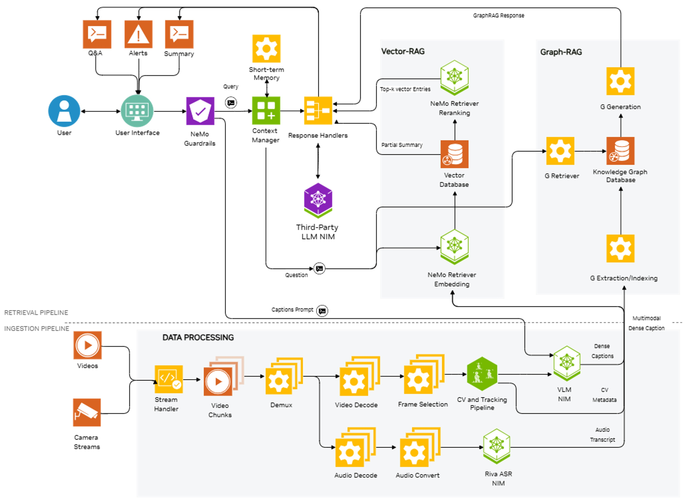

# Video Search and Summarization

The **Video Search and Summarization** pack is an AI Accelerator Pack that delivers a combined **hardware and software** solution for video search and summarization on Oracle Cloud Infrastructure (OCI). It enables deployment of GPU-backed infrastructure and the full [NVIDIA Video Search and Summarization (VSS)](https://docs.nvidia.com/vss/latest/) platform in one go. 


## What You Get

- **Hardware:** GPU-enabled OCI resources (instances and networking) sized for VSS workloads.
- **Software:** The NVIDIA VSS platform, including models, pipelines, and APIs for:
  - **Video captioning**: Generating text descriptions or summaries of videos or images.
  - **Q&A**: Answering questions about a video's or an image's content.
  - **Search and retrieval**: Finding specific alerts and highlights by text queries (e.g., safety, compliance).

Together, the pack is a **single solution** for deploying both the GPU environment and the VSS software stack on OCI.


## Use Cases

VSS is useful wherever you need to search, summarize, or reason over video without having to watch every minute. Typical applications include:

- **Content and media**: Generate highlights and summaries for long or archived recordings; power search and discovery ("find the moment when…") for editors and producers.
- **Surveillance and compliance**: Analyze recorded footage for policy violations, safety events, or specific behaviors; run alerts with natural language based triggers.

The stack also supports:

- **Audio**: Audio in the input is transcribed using NVIDIA Riva ASR and used to supplement video for summarization, Q&A, and alerts. [Documentation on Audio Processing Support](https://docs.nvidia.com/vss/latest/content/audio_support.html).

- **Computer vision (CV) pipeline**: The CV pipeline produces metadata for videos (object position, mask, tracking ID) using an object detector and tracker. This metadata is used to improve VLM accuracy and is attached to dense captions for indexing and retrieval. [Documentation on the CV Pipeline](https://docs.nvidia.com/vss/latest/content/cv_pipeline.html).

- **Context-Aware RAG**: The Context-Aware RAG module pulls relevant context from vector and graph stores to support temporal reasoning, anomaly detection, and multi-hop reasoning over large video datasets. The context manager keeps working context using chat history (short-term) and vector/graph databases (long-term) as needed. [Documentation on Context-Aware RAG](https://docs.nvidia.com/vss/latest/content/context_aware_rag.html).


## Architecture



For detailed component and data-flow documentation, see the [NVIDIA VSS Blueprint Architecture](https://docs.nvidia.com/vss/latest/content/architecture.html) and the rest of the [NVIDIA VSS documentation](https://docs.nvidia.com/vss/latest/).

**Deployment Architecture on OCI**

```
┌───────────────────────────────────────────────────────────────────────────┐
│  OCI Tenancy                                                              │
│                                                                           │
│  ┌─────────────────────────────────────────────────────────────────────┐  │
│  │  VCN                                                                │  │
│  │                                                                     │  │
│  │  ┌───────────────────────────────────────────────────────────────┐  │  │
│  │  │  OKE Cluster                                                  │  │  │
│  │  │                                                               │  │  │
│  │  │  ┌─────────────────────────────────────────────────────────┐  │  │  │
│  │  │  │  GPU Node Pool                                          │  │  │  │
│  │  │  │                                                         │  │  │  │
│  │  │  │  ┌───────────────────────────────────────────────────┐  │  │  │  │
│  │  │  │  │  VSS Platform                                     │  │  │  │  │
│  │  │  │  │                                                   │  │  │  │  │
│  │  │  │  │  ┌─────────────┐  ┌────────────┐  ┌───────────┐   │  │  │  │  │
│  │  │  │  │  │ VLM         │  │ Riva ASR   │  │ CV        │   │  │  │  │  │
│  │  │  │  │  │ (captioning │  │ (audio     │  │ Pipeline  │   │  │  │  │  │
│  │  │  │  │  │  + Q&A)     │  │  transcr.) │  │ (detect + │   │  │  │  │  │
│  │  │  │  │  │             │  │            │  │  track)   │   │  │  │  │  │
│  │  │  │  │  └──────┬──────┘  └─────┬──────┘  └─────┬─────┘   │  │  │  │  │
│  │  │  │  │         │               │               │         │  │  │  │  │
│  │  │  │  │  ┌──────▼───────────────▼───────────────▼──────┐  │  │  │  │  │
│  │  │  │  │  │         VSS API / Pipeline Engine           │  │  │  │  │  │
│  │  │  │  │  │  (summarization, search, alerts)            │  │  │  │  │  │
│  │  │  │  │  └──────────────────┬──────────────────────────┘  │  │  │  │  │
│  │  │  │  │                     │                             │  │  │  │  │
│  │  │  │  │  ┌──────────────────▼──────────────────────────┐  │  │  │  │  │
│  │  │  │  │  │  Context-Aware RAG                          │  │  │  │  │  │
│  │  │  │  │  │  (vector store + graph store)               │  │  │  │  │  │
│  │  │  │  │  └─────────────────────────────────────────────┘  │  │  │  │  │
│  │  │  │  └───────────────────────────────────────────────────┘  │  │  │  │
│  │  │  └─────────────────────────────────────────────────────────┘  │  │  │
│  │  │                                                               │  │  │
│  │  │  ┌──────────────┐   ┌──────────────┐                          │  │  │
│  │  │  │  Ingress /   │   │  Blueprints  │                          │  │  │
│  │  │  │ Load Balancer│   │  Portal      │                          │  │  │
│  │  │  └──────┬───────┘   └──────────────┘                          │  │  │
│  │  └─────────┼─────────────────────────────────────────────────────┘  │  │
│  └────────────┼────────────────────────────────────────────────────────┘  │
│               │                                                           │
│  ┌────────────▼────────────────┐                                          │
│  │  OCI Object Storage         │                                          │
│  │  (vss-test bucket — videos) │                                          │
│  └─────────────────────────────┘                                          │
│                                                                           │
└───────────────────────────────────────────────────────────────────────────┘
                │
                ▼
           VSS Web UI
   (video analysis + content
    moderation results)
```


## Deployment and Access

You can deploy the VSS Starter Pack from the **OCI Console**. Under **AI Accelerator Packs**, select the VSS pack (Video Search and Summarization for Content Moderation) and choose a deployment size, add the portal credentials and click Create. The console uses the pack's sizing to provision the right GPU compute, OKE cluster, networking, and the VSS software stack.

After deployment you get:

- **OCI AI Blueprints Portal**: The stack exposes the Blueprints portal URL.
- **VSS UI**: A web UI for VSS where you can select videos from object storage and analyze them to receive timestamp specific content moderation results, including categories and descriptions that can be reviewed and edited.

> **Note:** The VSS UI is not ready immediately after the stack succeeds. It takes approximately 25 more minutes for the pipeline to be loaded and ready. 

You can verify that the VSS pod is ready by logging into the Blueprints portal and checking the VSS pod's deployment logs under Deployments -> Deployment Group -> vss-deployment-group.. -> View Logs & Details.

When the pod is ready and the backend is accessible, you should see logs similar to:
```
INFO:     172.16.2.1:52520 - "GET /health/ready HTTP/1.1" 200 OK
INFO:     172.16.2.1:52534 - "GET /health/ready HTTP/1.1" 200 OK
INFO:     172.16.2.1:57784 - "GET /health/live HTTP/1.1" 200 OK
 ```

### Prerequisites

Before using the VSS UI, ensure that:

- **Object Storage Bucket**: A bucket named `vss-test` is created in the deployed compartment in the deployed region.

### Using the VSS UI

1. Upload the video files to the `vss-test` bucket in object storage.
2. Refresh the VSS UI page after adding new files to see them appear in the interface.
3. Once the pipeline is ready (as indicated by the health check logs), you can select the videos and analyze them.
4. If you want to change the bucket name or customize parameters, they can be changed under Settings.
